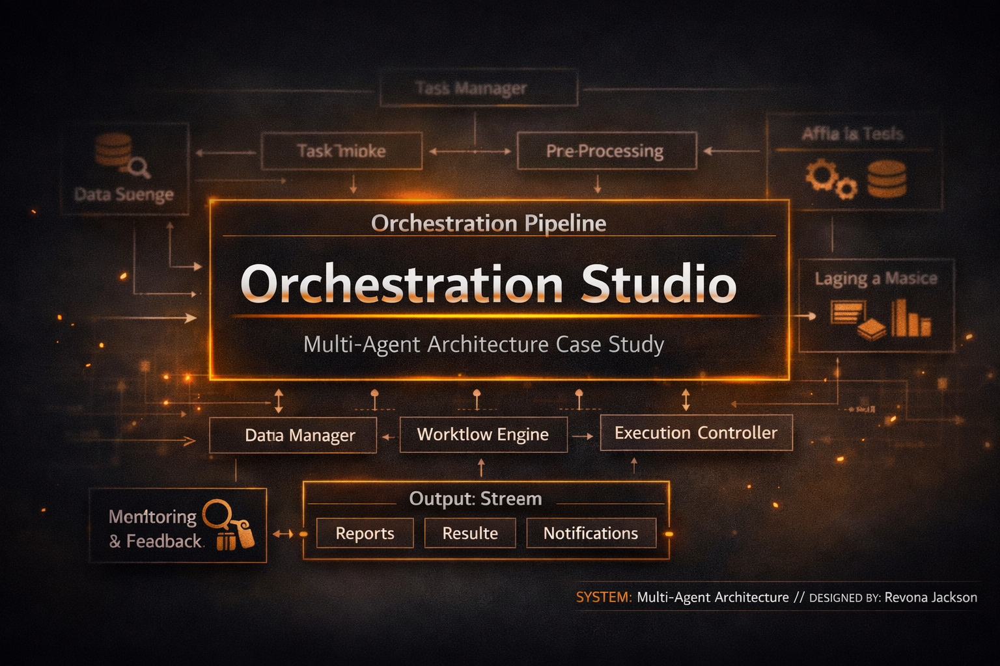

Overview: The Orchestration Studio
The Orchestration Studio is a creative operating system engineered to solve a modern problem: the velocity of digital creation has outpaced the capacity of any single human creator. Traditional workflows rely on linear effort — ideation, drafting, revising, optimizing, publishing — all performed manually, all constrained by time and cognitive load.

This studio replaces that model with a multi‑agent, systems‑driven architecture.
Instead of working in the process, the human director works above it — issuing strategic intent while the system handles execution.

The result is a creative environment that behaves like a distributed compute network: parallelized, self‑correcting, and capable of producing cross‑platform assets at enterprise scale.

This case study documents the architecture, logic, and operational mechanics of that system.

What This Case Study Covers
1. The Challenge
Why traditional creative workflows break under modern demands — and what problem the studio is designed to solve.

2. The Architecture
The structural backbone of the system, including the folder hierarchy, routing logic, and runtime execution loop.

3. The Multi‑Agent Workflow
How specialized agents collaborate, hand off tasks, and execute creative directives with deterministic precision.

4. The Impact
How this system transforms velocity, consistency, and cross‑platform coherence.

Director’s Note
This studio is not a metaphor.
It is a functional creative OS — one that evolves with every output, strengthens with every iteration, and expands its intelligence through continuous integration.

The goal is simple:
To build a creative system that scales without sacrificing quality, narrative integrity, or human vision.
